# Tutorial: from a played scene to an exported chapter

This walkthrough takes the bundled example, *Lantern Quay*, from the first move of a roleplay to a chapter ready for AO3. It takes about twenty minutes. Every screenshot comes from a real run: the play turns on Claude Sonnet 5.5, the editing on a local Gemma 4 31B.

**You need:**

- ProseWright installed and its server running (see [Quick start](../README.md#quick-start)).
- For playing: Claude Code signed in, or an Anthropic API key (see [Player mode](../README.md#player-mode)). The play part of this tutorial is three model calls, about 15¢ at API list prices, or a little of your plan's usage through Claude Code.
- For editing: any OpenAI-compatible model, local or hosted (see [The editor's operations](../README.md#the-editors-operations)).

---

## 1. The editor

Open <http://127.0.0.1:8765/app>. With nothing configured, the editor opens *Lantern Quay*: three scenes in the working log, played out in advance so there is something to read.

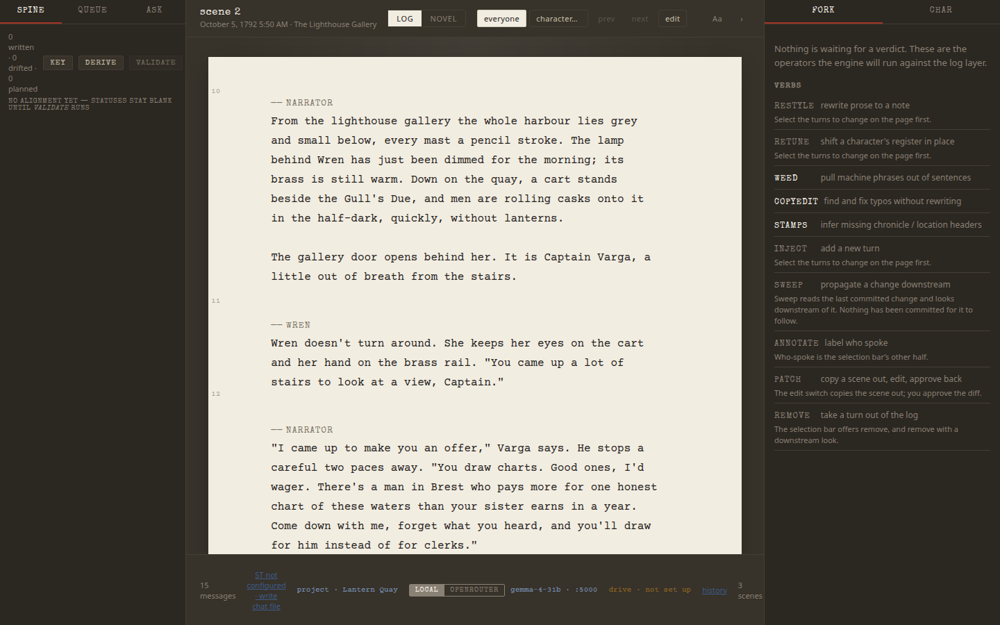

- **Center:** the page, one layer at a time: **log** (the turns as played) and **novel** (prose drafted from them). The header names the scene and its time and place; `j` / `k` move between scenes.
- **Left:** **spine** (the story's structure), **queue** (prose review), **ask** (questions about the story).
- **Right:** **fork** (where proposed changes wait for your verdict) and **char** (the cast).
- **Bottom:** the status bar: the project, the model the editor uses, Drive sync, and history.

## 2. A project to play in

Playing needs a *play folder* (the world: scene cards, hidden truths, the cast) and a project to collect what you play. Make both from the examples:

```bash
mkdir -p ~/stories && cp -r examples/lantern-quay-play ~/stories/
mkdir -p ~/stories/quay-played/workspace
cp -r examples/lantern-quay/canon ~/stories/quay-played/
```

and give the project a `~/stories/quay-played/project.json` that names the play folder:

```json
{
  "schema": "story-editor/project@1",
  "id": "quay-played",
  "title": "Lantern Quay, played",
  "log": "workspace/played.jsonl",
  "integrations": { "player_mode": { "home": "~/stories/lantern-quay-play" } }
}
```

Register it with `python -m story_editor project add ~/stories/quay-played` (or paste the folder into the projects panel's box and press **add**), then open it from the **project** chip in the status bar. The server restarts on the new project.

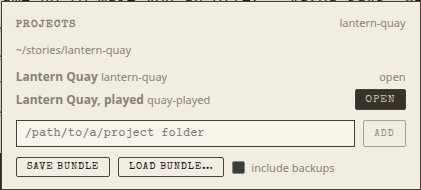

## 3. Play

A **play** tab appears next to log and novel.

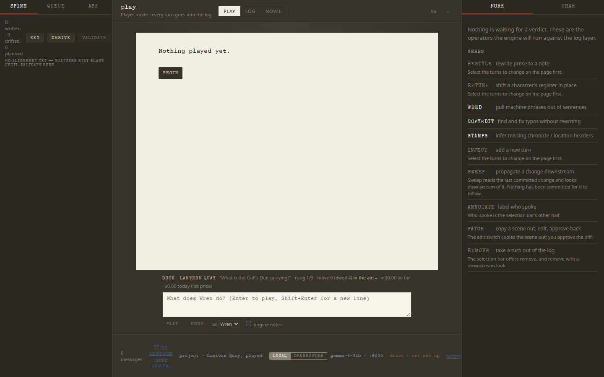

Under the page is the scene's status line: the scene (*Dusk · Lantern Quay*), its dramatic question, the rung of its escalation ladder, moves played against the minimum dwell, who is on stage, the open mystery, and the cost so far. Press **begin**: the director sets the scene and the narrator writes the opening, from Wren's side only.

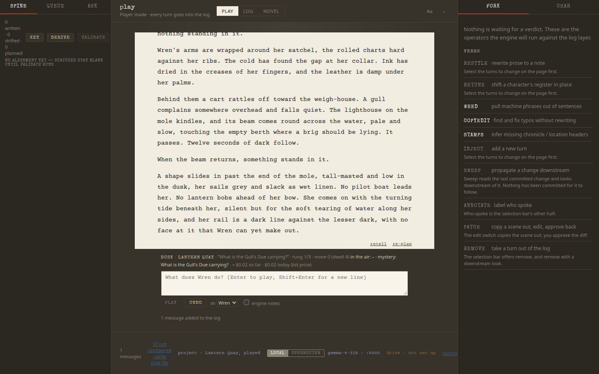

The *Gull's Due* has come in at dusk with no pilot, and the scene's mystery is now in the status line. Type what Wren does, in prose or in quotes, and press **Enter**:


The director reads the move, picks one change for the world to make, and the narrator writes it:

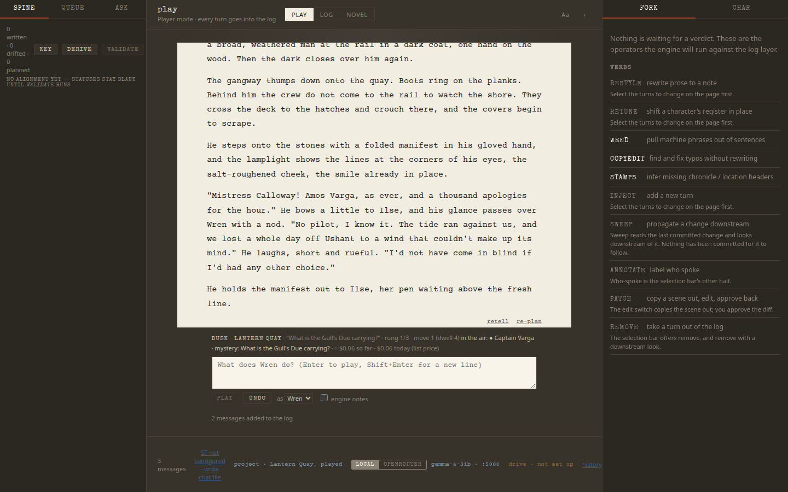

The ladder has moved to rung 2/3 and the mystery has sharpened. Under the reply, *2 messages added to the log* says the move and the reply are already in the project's working log.

Not happy with a reply?

- **retell** writes the same events again in new prose. Every telling is kept, SillyTavern-swipe style: **‹ ›** switches between them, and the log follows the one you choose.
- **re-plan** plays the turn again from scratch, so something else can happen.
- **undo** takes the last turn back, out of the play folder and out of the log.

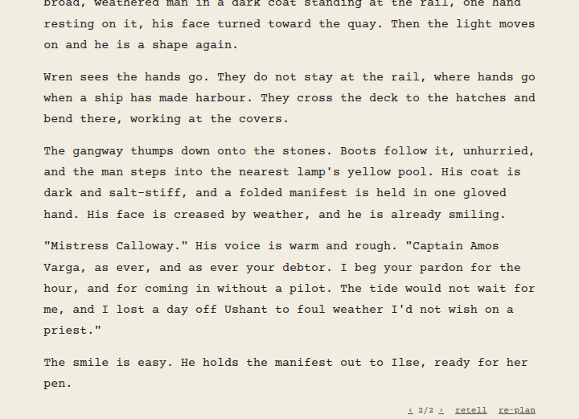

When a scene's exit condition is met after its minimum dwell, a banner offers **cut to the next scene** or **stay**. **as** switches you to another character in your party, and **engine notes** shows what the engine's checks caught on each turn: an exit blocked by the dwell, a trimmed stage, a secret that nearly leaked.

## 4. The played turns in the log

Switch to **log**. The turns you played are here, with a scene header from the scene card and a label saying who each one voices:

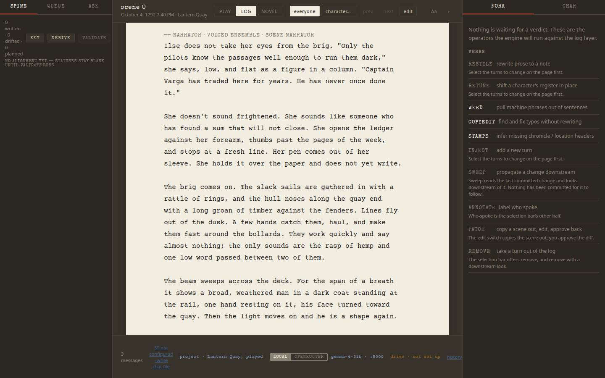

From here on they are ordinary log turns: you can edit, restyle and novelize them while you keep playing. Messages already in the log are never rewritten by play.

## 5. The cast

Open **char** on the right. Everyone with a bible is listed with how often they are voiced, are the point of view, or are named; characters the engine introduces while you play are filed here too, under *filed from play*, as lightweight bibles you can flesh out later.

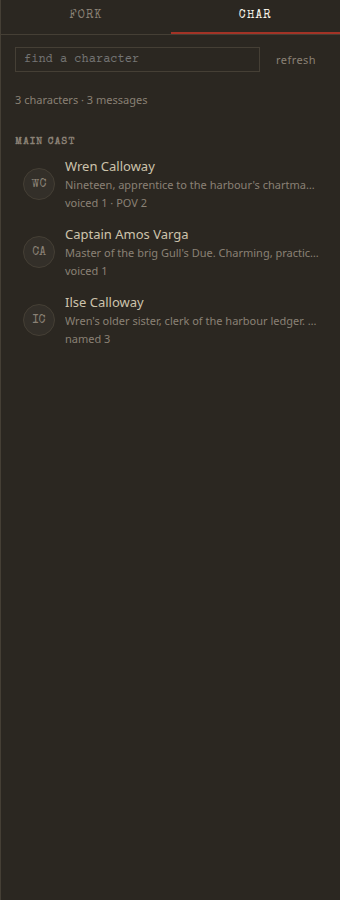

Click a name for the card: the bible's summary, voice rules, dossier, and every scene they are in, each a jump to the page.

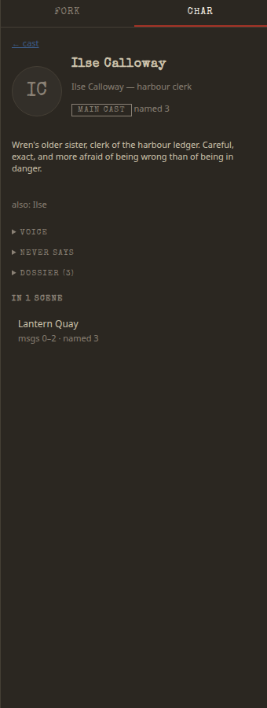

## 6. Revise a passage

Back on the original *Lantern Quay* project (the **project** chip again), go to scene 2, *The Lighthouse Gallery*, in the **log**. Select a few turns by dragging across them; a bar appears with what you can do with the selection:

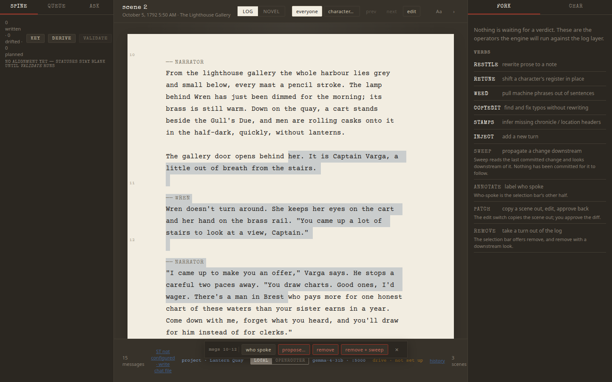

**propose…** opens the operators. Pick **restyle**, say what to change, and press **propose**:

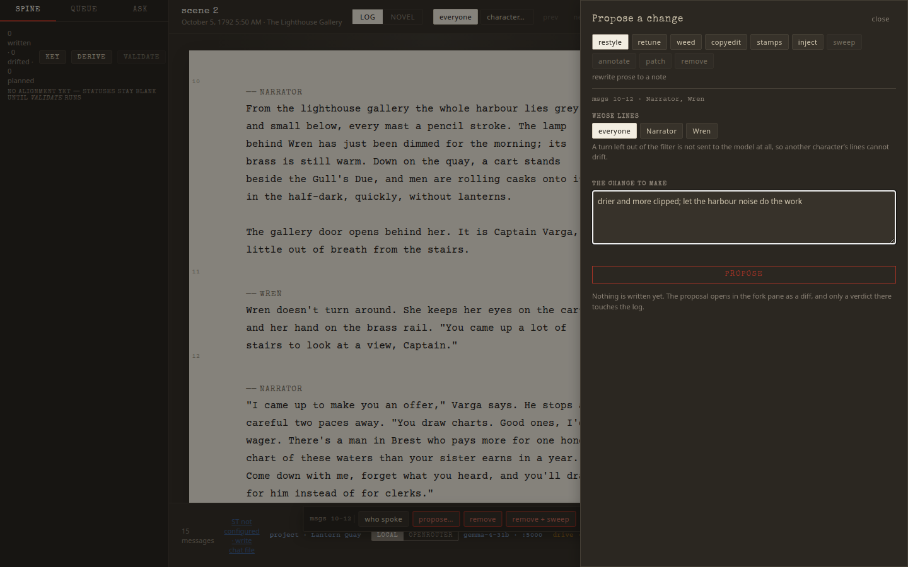

**whose lines** limits the change to one speaker's turns: a turn left out is not even sent to the model, so another character's lines can't drift.

Nothing is written yet. The proposal opens in **fork** as a diff, turn by turn:

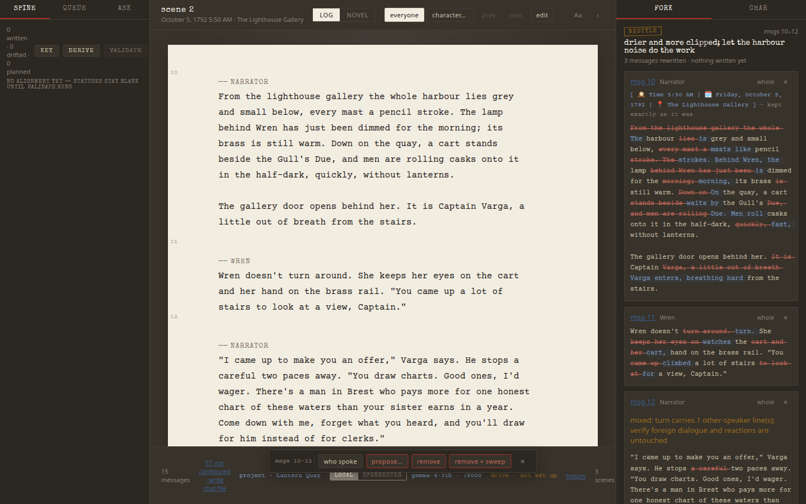

Accept or reject each turn, or all of them at once. The fork also flags what needs a look before you accept: here, a narrator turn that carries another character's dialogue. An accepted change keeps a backup of the log and can be undone from **history**.

The other operators work the same way: **retune** (shift a character's register in place), **weed** (pull machine phrases out of sentences), **copyedit** (fix typos without rewriting), **stamps** (infer missing time and place headers), **inject** (add a new turn), **remove** (take a turn out), **sweep** (carry a change downstream).

## 7. Novelize a scene

Switch to **novel**. A scene with no prose yet shows what novelizing it would do and in which voice: person, tense, and the character it follows.

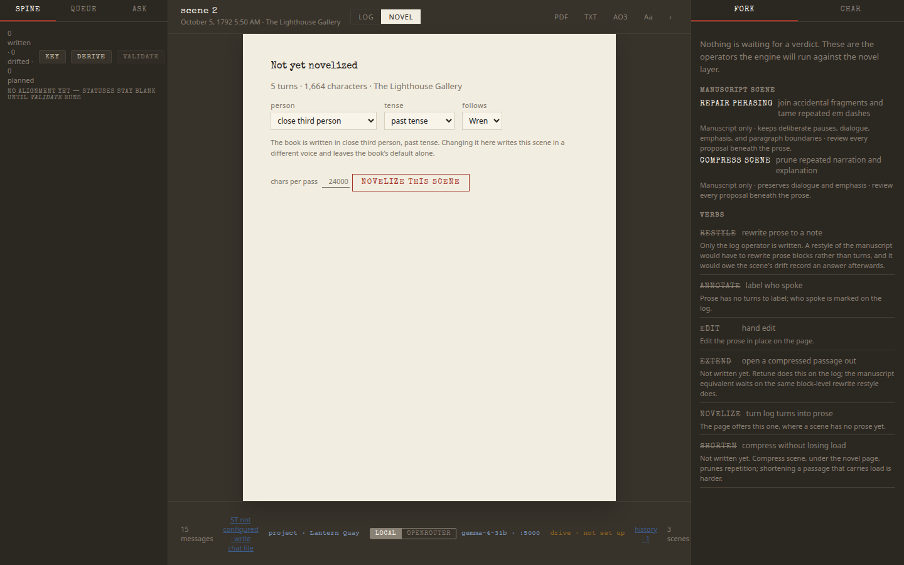

**novelize this scene** writes it as prose from the turns.

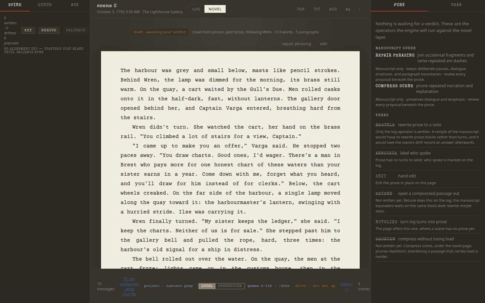

The prose is a draft awaiting your verdict: edit it in place, run **repair phrasing** or **compress scene** on it, and **approve** it when the scene is finished. Exports take the novel layer's current prose, approved or still a draft.

## 8. Export

In the **novel** layer, the **PDF**, **TXT** and **AO3** buttons export chapters. A story without a locked chapter map gets one chapter per scene; chapters with no prose yet are greyed out:

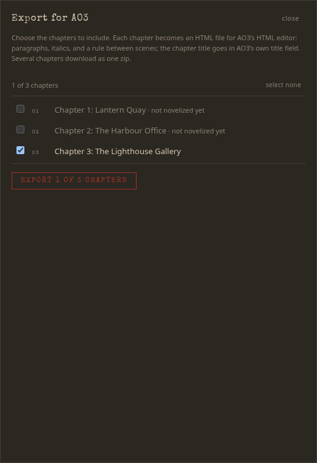

AO3 export writes one HTML file per chapter, ready to paste into AO3's HTML editor (several chapters download as a zip). PDF needs Chrome or Chromium installed.

---

## Where next

- **Your own story:** [docs/PROJECTS.md](PROJECTS.md) for the project folder, and [docs/PLAYER_MODE.md](PLAYER_MODE.md) for writing a play folder: scene cards, truths, the cast.
- **Models:** run the director on Claude and the narrator on a local model, and compare setups with `kp bench`: [Models and credentials](../README.md#models-and-credentials).
- **Save and move a project:** the **project** chip's **save bundle** and **load bundle…**, or `python -m story_editor project save | load`.
- **The command line:** everything here is also `python -m story_editor …` and `kp …`.
